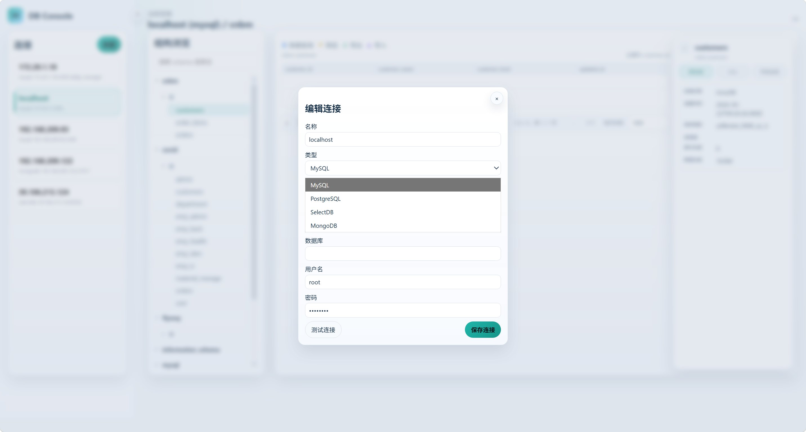
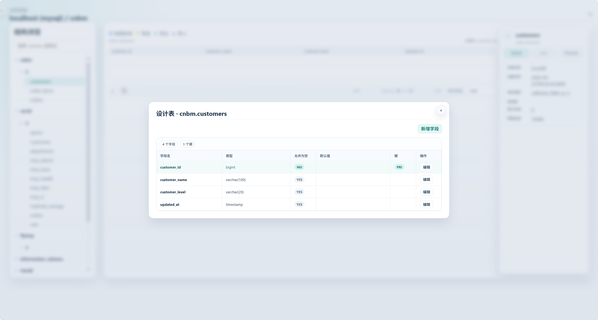

# DB Console MVP

一个受 Navicat 启发的 Web 数据库管理工具（MVP），用于在浏览器中管理连接、执行查询、浏览数据和导入导出。

## 功能特性

- 数据库连接管理
  - 新增、编辑、删除、测试连接
  - 本地保存连接配置（`data/connections.json`）
  - 连接密码使用 AES-256-GCM 加密保存（密钥文件：`data/encryption.key`）
- 多数据库支持
  - MySQL
  - PostgreSQL
  - MongoDB
  - SelectDB（按 MySQL 协议连接）
- 查询与执行
  - SQL 编辑与执行（集成 Monaco Editor）
  - 多语句拆分执行
  - 危险 SQL 检测（如无 `WHERE` 的 `UPDATE/DELETE`、`DROP/TRUNCATE` 等）
  - MongoDB 支持 JSON 指令和脚本执行模式
- 数据浏览与编辑
  - 浏览库/表结构
  - 表数据分页查询、筛选
  - 行级新增、更新、删除
- 导入导出
  - 表数据导出：CSV / XLSX
  - CSV 导入到现有表
  - 基于 CSV 自动建表并导入

## 技术栈

- 后端：Node.js + Express
- 数据库驱动：`mysql2`、`pg`、`mongodb`
- 前端：原生 `HTML/CSS/JavaScript` + `monaco-editor`
- 文件处理：`multer`、`xlsx`

## 环境要求

- Node.js `>=14`

## 快速开始

```bash
npm install
npm start
```

启动后访问：`http://localhost:3000`

可通过环境变量修改端口：

```bash
PORT=3001 npm start
```

## 目录结构

```text
.
├─ public/                # 前端静态资源
├─ data/                  # 连接配置与加密密钥
│  ├─ connections.json
│  └─ encryption.key
├─ uploads/               # 导入临时文件目录
├─ server.js              # 后端入口
└─ package.json
```

## 安全与注意事项

- 请勿将 `data/encryption.key`、`data/connections.json` 提交到版本库。
- `uploads/` 为导入临时目录，建议定期清理日志和临时文件。
- 这是 MVP 工具，建议仅在内网或受控环境使用。

## 界面截图

### 新建连接



### 设计表



## 常见问题

- `端口占用`：修改 `PORT` 后重新启动。
- `连接失败`：检查数据库地址、端口、账号密码和网络策略。
- `MongoDB 认证失败`：确认用户名密码及认证数据库配置。
